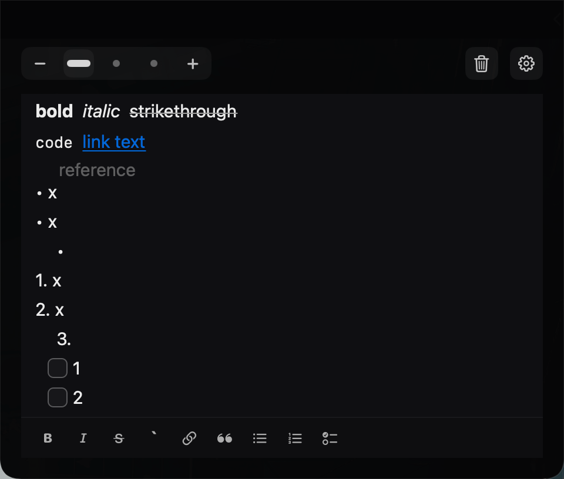

# NotchNotes

NotchNotes is a small native macOS note app that lives at the top edge of your MacBook screen. Move the cursor to the notch area and it unfolds into a dark Markdown notebook for quick tasks, links, screenshots, and tiny reminders.

This is originally a fork of [NotchNotes](https://github.com/oil-oil/NotchNotes). I fixed some bugs and optimized its performance.



## Download

- [Download the latest release](https://github.com/wutongyuonce/NotchNotes/releases/latest)

After downloading, unzip the app, move it to Applications, then right-click and choose Open on the first launch.

## Stack

- Swift + AppKit for the floating panels, window levels, screen targeting, and cursor-triggered behavior.
- SwiftUI for the notebook interface.
- UserDefaults for lightweight local note storage.
- MarkdownEngine for live Markdown editing and embedded images.

## Run

```bash
swift run NotchNotes
```

After launch, move the cursor to the top-center notch area. The compact notch container expands into the notebook panel.

## Package

```bash
./Scripts/package-app.sh
open NotchNotes.app
hdiutil create -volname "NotchNotes" -srcfolder NotchNotes.app -ov -format UDZO NotchNotes.dmg
```

## Distribution

The current downloadable ZIP is intended for testing. For public distribution outside the Mac App Store, sign the app with a Developer ID Application certificate and submit it for Apple notarization.